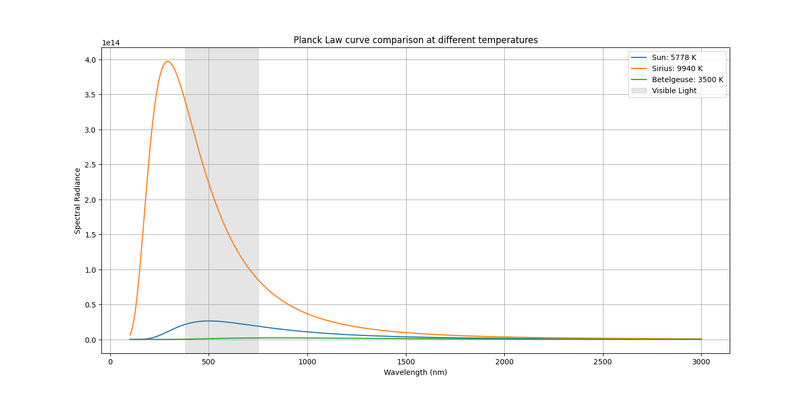

# Stellar Blackbody Radiation

This project visualizes the blackbody radiation spectra of stars using **Planck's Law** and integrates the curves to compute total radiated flux. It also highlights the visible light region for easy comparison between different stellar temperatures.

## Features

- Implements Planck's law for spectral radiance.
- Computes peak wavelength (Wien’s law).
- Integrates spectrum (numerical integration with `scipy.integrate.simpson`) to estimate radiated flux.
- Compares spectra of the Sun, Sirius, and Betelgeuse.
- Highlights the visible light range (380–750 nm).

## Requirements

- Python 3.x
- NumPy
- Matplotlib
- SciPy

Install dependencies with:

```bash
pip install numpy matplotlib scipy
```

## Usage

Run the script:

```
python blackbody.py
```

It will:

- Print peak wavelengths and total flux for each star.
- Plot the blackbody curves with the visible band shaded.

## Example Output

```
Peak wavelength for T = 5778 K is: 501.00 nm
Total radiated power per unit area for T = 5778 K is: 1.97e+07 W/m^2
Peak wavelength for T = 9940 K is: 291.78 nm
Total radiated power per unit area for T = 9940 K is: 1.75e+08 W/m^2
Peak wavelength for T = 3500 K is: 826.45 nm
Total radiated power per unit area for T = 3500 K is: 2.50e+06 W/m^2
```

**Output Plots**


## Author

Samreet S. Dhillon  
M.Sc Physics,  
Panjab University, Chandigarh.
